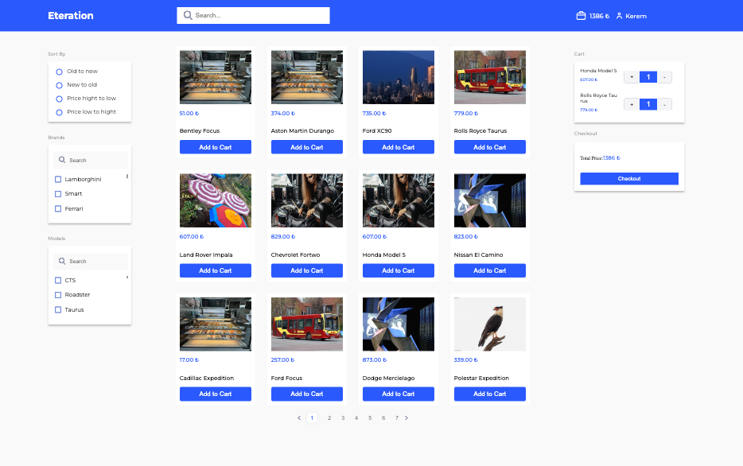

E-Commerce Frontend Case Study

## Table of Contents

- [Overview](#overview)
  - [Features](#features)
- [Project Structure](#project-structure)
- [Setup and Running](#setup-and-running)
- [Run Tests](#run-test)
- [Redux and Redux-Saga Workflow](#redux-and-redux-saga-workflow)
- [Workflow in This Project](#workflow-in-this-project)
- [Contact](#contact)
- [Acknowledgements](#acknowledgements)

## Overview
	

	This repository contains an e-commerce application developed using Redux and Redux-Saga. Built with React and TypeScript, this application features product listing and detail views. It also provides basic e-commerce functionality such as adding products to a shopping cart.

## Features
	Product Listing Page: Allows users to view various products and access their details.
	Product Detail Page: Displays detailed information about each product.
	Add to Cart and Cart Summary: Enables users to add products to their cart and lists the added items.
	Redux and Redux-Saga: Used for state management and controlling side effects.
	Unit Tests: Ensures robustness and fault tolerance of the application.
	Technologies Used
		- React
		- TypeScript
		- Redux
		- Redux-Saga
		- Axios
		- React Router DOM
		- Vitest
		- Testing Library

## Project Structure

src/
├── app/
│   ├── store.ts
│   └── rootSaga.ts
├── components/
│   ├── CartItem.tsx
│   ├── CartItemBasket.tsx
│   ├── CartItemsList.tsx
│   ├── CartSummary.tsx
│   ├── Checkout.tsx
│   ├── Filter.tsx
│   ├── NavBar.tsx
│   ├── Pagination.tsx
│   ├── ProductCard.tsx
│   ├── SearchBar.tsx
│   ├── SortProduct.tsx
│   └── UserProfile.tsx
├── features/
│   ├── cart/
│   │   ├── cartSlice.ts
│   │   └── cartSaga.ts
│   └── products/
│       ├── productsSlice.ts
│       └── productsSaga.ts
├── hooks/
│   └── useFetch.ts
├── pages/
│   ├── ProductDetail.tsx
│   └── ProductList.tsx
├── services/
│   └── api.ts
├── styles/
│   └── global.css
│   ├── cart-item-basket.module.css
│   ├── cart-item.module.css
│   ├── cart-item-list.module.css
│   ├── check-out.module.css
│   ├── filter.module.css
│   ├── navbar.module.css
│   ├── product-card.module.css
│   ├── product-detail.module.css
│   ├── product-list.module.css
│   ├── profile.module.css
│   ├── search-bar.module.css
│   └── sort.module.css
├── tests/
│   └── components/
│       ├── CartSummary.test.tsx
│       └── ProductCard.test.tsx
└── App.tsx
## Setup and Running
	Follow these steps to get the project up and running on your local machine.

	Clone the Project and Install Dependencies
	Start the Development Server

```bash
$  git clone https://github.com/username/frontend-case-study.git
$  cd frontend-case-study
$  npm install
$  npm run dev
```

## Run Tests
```bash
$  npm run test
```
## Redux and Redux-Saga Workflow
	What is Redux-Saga?
	Redux-Saga is a library used to manage side effects in Redux-based applications. It is especially preferred for asynchronous operations (API calls, localStorage operations, etc.).

## Workflow in This Project
	Store Structure:

	store.ts creates the Redux store and adds saga middleware.
	rootSaga.ts combines all sagas.
	Managing Products with Redux-Saga:

	Slice: productsSlice.ts uses Redux slice logic to define a reducer and actions for products.
	Saga: productsSaga.ts defines a saga function to fetch products from the API.
	Saga Flow

	graph TD
	A[Store] --> B[Product Slice]
	B --> C[Redux Action: fetchProductsStart]
	C --> D[Product Saga]
	D -->|API Call| E[fetchProductsSuccess / fetchProductsFailure]
	E --> B
	Example Usage
	In ProductList.tsx, the fetchProductsStart action is triggered when the product listing page is loaded.
	This action activates the fetchProductsSaga function in productsSaga.ts.
	fetchProductsSaga fetches the products from the API and passes the result to Redux state via the fetchProductsSuccess or fetchProductsFailure actions.


## Contact

- GitHub: [@AtillaTahak](https://github.com/AtillaTahak)
- Twitter: [@AtillaTahaa](https://twitter.com/AtillaTahaa)
- LinkedIn: [LinkedIn](https://www.linkedin.com/in/atillatahakordugum)
- Blog: [Blog](https://atillataha.blogspot.com)
- Youtube: [YouTube](https://www.youtube.com/channel/UCmoD0x4Z9vdG2PCsI5p8FYg)
- Portfolio: [Portfolio](atillataha.netlify.app)
